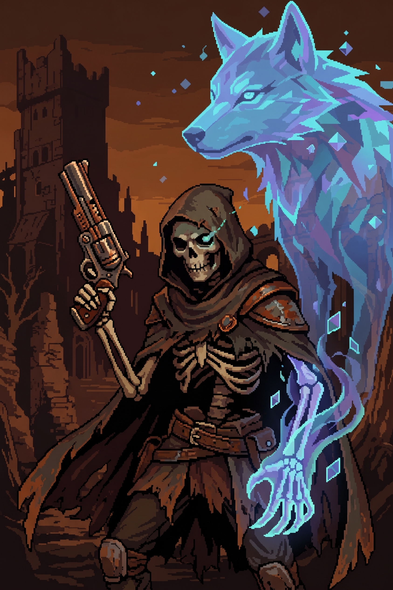
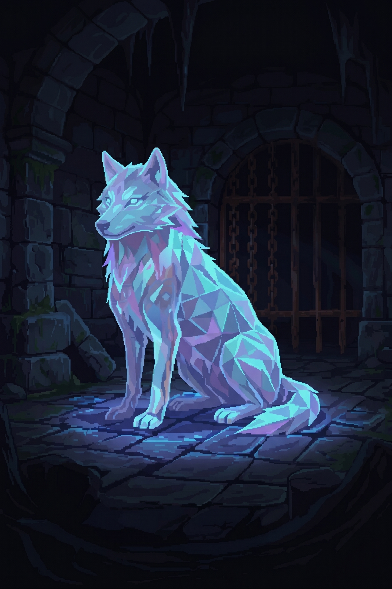

## Protagonista: 
<!--falta preencher motivação, arco, imagem antes/depois etc.-->

**Habilidades:** arma modular (ver [Arma modular](02-gameplay.md#arma-modular)), esquiva/rolagem (ver [Esquiva](02-gameplay.md#esquiva)), vida própria e independente do companion (ver [Vida](02-gameplay.md#vida)).

---
## Companion: 
<!-- ações disponíveis, forma de controle, o que é, de onde veio, qual o objetivo? -->

**Ações disponíveis** (via menu contextual):
- Ações base: mover, esquivar (dash/rolagem), atacar, ficar parado (desativa a IA).
- Habilidades especiais (limite de 2): trocar de posição, curar jogador, restringir/atordoar inimigo, atrair inimigos

**Forma de controle:** menu contextual que desacelera o tempo ao abrir; uso do menu tem tempo limite/cooldown entre usos, com indicação visual. Fora de combate, age com IA simples que segue o jogador e evita obstáculos/perigos automaticamente. Ver [Companion](02-gameplay.md#companion) para detalhes funcionais completos.

---
## NPCs principais e boss intermediário 
<!-- (resumo funcional, detalhe de motivação vai em `docs/narrativa/`) --> 

---
## Inimigos comuns: 
<!-- tipos, comportamento, IA básica -->
Tipos, comportamento e atributos detalhados em [Inimigos](02-gameplay.md#inimigos). 

---
## Progressão de personagem (upgrades, skill tree), se houver

---
## Boss final
