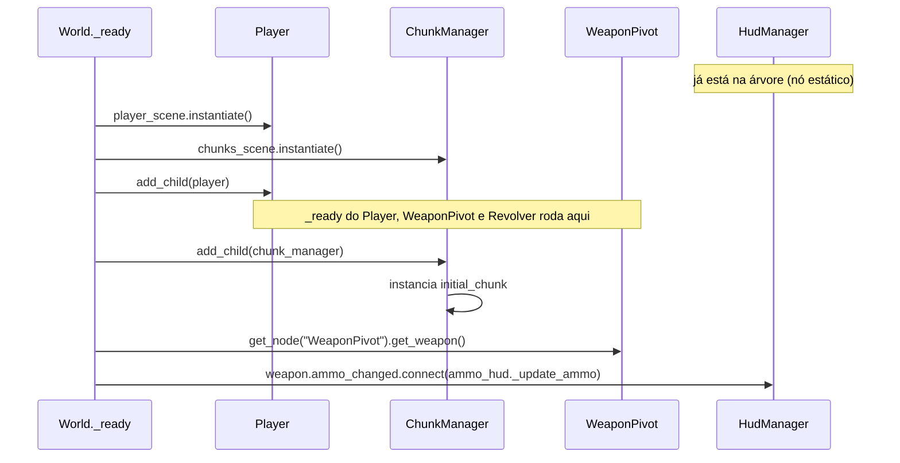

# 01 — Main Scene Tree

**Cena principal do projeto:** `scenes/World.tscn` (configurada em `project.godot` → `run/main_scene`).
**Script:** `scripts/world.gd`

## Responsabilidade do `World`

| Responsabilidade | Status |
|---|---|
| Ser a raiz: tudo nasce dele e roda como filho dele | [OK] |
| Instanciar o `Player` e o `ChunkManager` a partir de `PackedScene` exportadas | [OK] |
| Hospedar o `HudManager` (`CanvasLayer`) | [OK] |
| Ligar a arma do player à HUD de munição | [OK] (ver [observações](#observações-do-código)) |
| Gerenciar eventos que pausam o jogo e chamam interface alternativa (mapa, menu de pause) | [PLANEJADO] |
| Configuração de câmera | [ABERTO] ver [02](02-chunk-manager.md#câmera) |

## Árvore em runtime

```
World (Node2D)                        [world.gd]
├── HudManager (CanvasLayer)          [hud_manager.gd]    ← estático no World.tscn
│   └── AmmoHud (Control)             [ammo_hud.gd]       ← instanciado por hud_manager.gd
├── Player (CharacterBody2D)          [player.gd]         ← instanciado por world.gd
│   ├── AnimatedSprite2D
│   ├── CollisionShape2D
│   ├── WeaponPivot (Node2D)          [weapon_pivot.gd]
│   │   └── Revolver (Node2D)         [revolver.gd]       ← instanciado por weapon_pivot.gd
│   │       ├── Sprite2D
│   │       └── Tip (Marker2D)
│   └── ReloadBar (TextureProgressBar)
├── ChunkManager (Node2D)             [chunk_manager.gd]  ← instanciado por world.gd
│   └── Level01 (Node2D)                                  ← initial_chunk
│       └── TileMapLayer
└── Bullet (Node2D) ...                                   ← instanciadas pelas armas em runtime
```

O `World.tscn` no disco só contém o `World` e o `HudManager`. O resto é montado por código em `_ready()`.

## Como o `World` monta o jogo



**Exports do `World`:** `player_scene` e `chunks_scene` (configurados no `World.tscn`).

## [ABERTO] Ordem de desenho (z_index)

`ChunkManager` é adicionado **depois** do `Player`, então por ordem de árvore ele seria desenhado por cima. Hoje isso é contornado com `z_index` negativo nos chunks:

| Elemento | z_index |
|---|---|
| Chão do `Chunk_0_0` (Polygon2D) | -5 |
| `TileMapLayer` do `Level01` | -2 |
| Sprite do player | 0 (1 quando olhando pra cima) |

[SUGESTÃO] Vale criar uma convenção. 
Ex: *todo chão/cenário de chunk usa z_index negativo*, pra o player nunca ficar atrás do chão. 
Enquanto isso não for documentado em cada chunk, é fácil esquecer ao criar um novo.

## [ABERTO] Interfaces alternativas e pause

Ideia atual: o `World` gerencia qualquer evento que pausa a jogabilidade e abre interface alternativa (mapa, menu de pause).

[SUGESTÃO] Podemos optar (caso pareça melhor) por um nó acima do `World` que controle as interfaces. O mecanismo nativo da Godot é `get_tree().paused = true`, com `process_mode = PROCESS_MODE_WHEN_PAUSED` no nó da interface e `PROCESS_MODE_PAUSABLE` (padrão) no mundo. Isso funciona tanto com as interfaces dentro do `World` quanto com um nó pai.

## Observações do código

1. [RESOLVER] **Duas formas de compor o `World`.** O `HudManager` está fixo no `.tscn`; `Player` e `ChunkManager` são instanciados por código via `@export PackedScene`. Funciona, mas vale escolher um padrão e manter.
2. [RESOLVER] **Sincronia na ligação arma -> HUD.** O `Revolver` emite `ammo_changed` no próprio `_ready()`. Esse `_ready()` roda dentro de `add_child(player)`, **antes** do `World` conectar o signal. Logo, a HUD **não recebe o valor inicial**; só passa a atualizar no primeiro tiro/reload.
3. [RESOLVER] **`World` alcança internos de outros sistemas.** Ele faz `player.get_node("WeaponPivot")` e chama `$HudManager.ammo_hud._update_ammo` (método com prefixo `_`, que por convenção é privado). Ver sugestão em [06](06-hud.md#sugestões).
4. [RESOLVER] **Dependência de `get_tree().current_scene`.** O `Revolver.fire()` adiciona a bala em `get_tree().current_scene`, que hoje é o `World` por ser a cena principal. Se um dia o `World` passar a ser filho de outro nó (o "nó de interfaces" cogitado acima), `current_scene` passa a apontar para o pai e as balas nascem no lugar errado.
