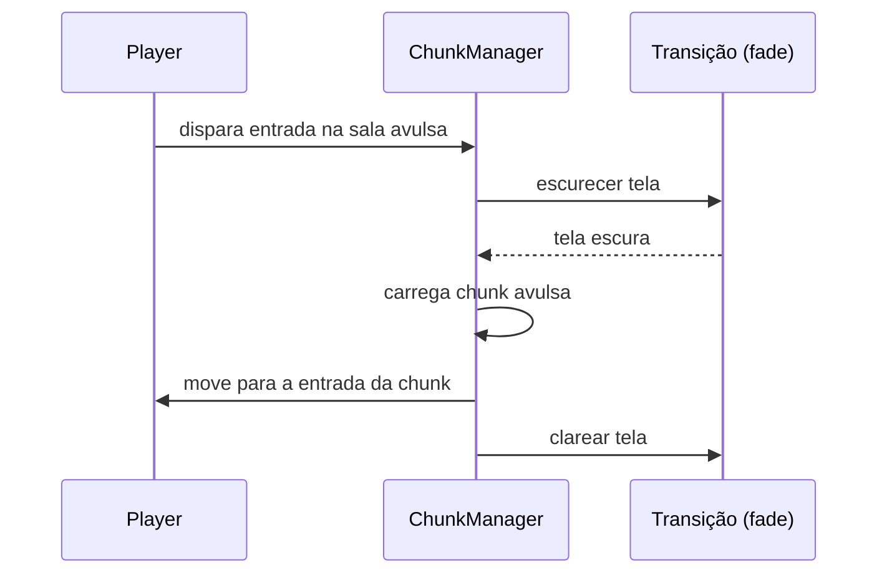

# 02 — ChunkManager

**Cena:** `scenes/world/Chunk_manager.tscn` · **Script:** `scripts/chunk_manager.gd` (`class_name ChunkManager`)

## Responsabilidade

Decidir **qual é a chunk atual do player** e **quais chunks ficam carregadas na memória** ao redor dela. Ele não sabe nada de inimigos, itens ou colisão interna das chunks; isso é problema de cada chunk.

## Estado atual

| Item | Status |
|---|---|
| Instanciar uma chunk inicial (`@export initial_chunk`, hoje `level_01.tscn`) | [OK] |
| Detectar troca de chunk | [PLANEJADO] |
| Carregar/descarregar chunks num raio de X | [PLANEJADO] |
| Chunks avulsas (tutorial, boss) com transição | [PLANEJADO] |
| Overlay de debug em "tabuleiro de xadrez" | [PLANEJADO] |

Hoje o `_ready()` só faz `initial_chunk.instantiate()` + `add_child()`.

## Conceito de chunk

- Cada chunk é uma **scene independente**, com seus próprios nós de colisão, objetos, itens e spawn de inimigos.
- O `ChunkManager` só instancia/remove essas scenes; não conhece o conteúdo.

### [PLANEJADO] Chunks em grade

O mapa principal é uma grade. Os arquivos já seguem uma convenção de nome que permite montar o caminho a partir da coordenada:

```
scenes/world/Chunk_<x>_<y>.tscn      →   Chunk_0_0.tscn, Chunk_1_1.tscn
```

Hoje `Chunk_0_0` e `Chunk_1_1` são placeholders (`Polygon2D` + `StaticBody2D` com um bloco de colisão) e **nenhum dos dois é referenciado ainda**. O `level_01.tscn` (com `TileMapLayer`) é o que está em uso como chunk inicial.

### Chunks avulsas (tutorial, boss) 📝

Algumas áreas ficam **desprendidas do mapa**: a sala do tutorial e a sala do boss. Por serem ambientes menores que o mapa, cada uma é tratada como **uma única chunk à parte**.

Fluxo de entrada:



[ABERTO] Quem é dono do fade: o `HudManager` (já é um `CanvasLayer`) ou uma camada própria de transição.

## Troca de chunk [PLANEJADO]

Um objeto de colisão **na chunk atual** indica que o player trocou de chunk.
Cada chunk tem uma `Area2D` de trigger cobrindo sua área. Quando o player entra (`body_entered`), a chunk avisa o manager (por signal), e o manager recalcula o conjunto carregado. Isso depende da configuração de layers/masks de [05](05-colisao-combate.md).

## Raio de carregamento [PLANEJADO]

O manager mantém carregadas as chunks num raio de **X** chunks da ativa. Exemplo com X = 1 e chunk ativa em (2,2):

```
         x:  0  1  2  3  4
  y: 0       .  .  .  .  .
  y: 1       .  ■  ■  ■  .
  y: 2       .  ■  ◆  ■  .        ◆ = chunk ativa
  y: 3       .  ■  ■  ■  .        ■ = carregada
  y: 4       .  .  .  .  .        . = descarregada
```

## Contrato de uma chunk

Toda chunk deve ter:

| Elemento | Para quê |
|---|---|
| Raiz `Node2D` | Padrão atual |
| `Area2D` de trigger | Detectar entrada do player |
| `Marker2D` de entrada | Ponto onde o player aparece (obrigatório nas avulsas) |
| Limites/bounds da área | Usado pela câmera (ver abaixo) |
| Chão/cenário com `z_index` negativo | Ver [01](01-main-scene-tree.md#ordem-de-desenho-z_index) |

## [ABERTO] Câmera

Algumas opções que ainda precisamos ponderar e decidir sobre a câmera
| Opção | Prós | Contras |
|---|---|---|
| **A. `Camera2D` filha do `Player`** | Segue o player sem código extra; o player já persiste entre chunks | Precisa receber os limites da chunk ativa |
| B. `Camera2D` no `World` | Centraliza a config de câmera junto com os outros sistemas globais | Precisa de script pra seguir o player |
| C. `Camera2D` no `ChunkManager` | Fica perto de quem sabe a chunk ativa | Mistura responsabilidades; o manager passa a conhecer o player |

## Decisões em aberto

- [RESOLVER] **Persistência:** quando uma chunk sai do raio e é descarregada, o que acontece com o estado dela (inimigos mortos, itens coletados)? Hoje um `queue_free()` apagaria tudo, e ao recarregar ela voltaRIA zerada.
- [RESOLVER] Enquanto o player está numa sala avulsa, as chunks da grade continuam carregadas ou são descarregadas?
- [RESOLVER] Chunks têm tamanho fixo? (O `Chunk_0_0` mede cerca de 1200×660 px, na ordem de uma tela.)
- [RESOLVER] Como o manager mapeia coordenada -> scene: pela convenção de nome (`Chunk_<x>_<y>.tscn`) ou por uma tabela exportada?
- [RESOLVER] Que chunk o jogador vê primeiro: o tutorial (avulsa) ou uma da grade? Afeta o `initial_chunk`.
