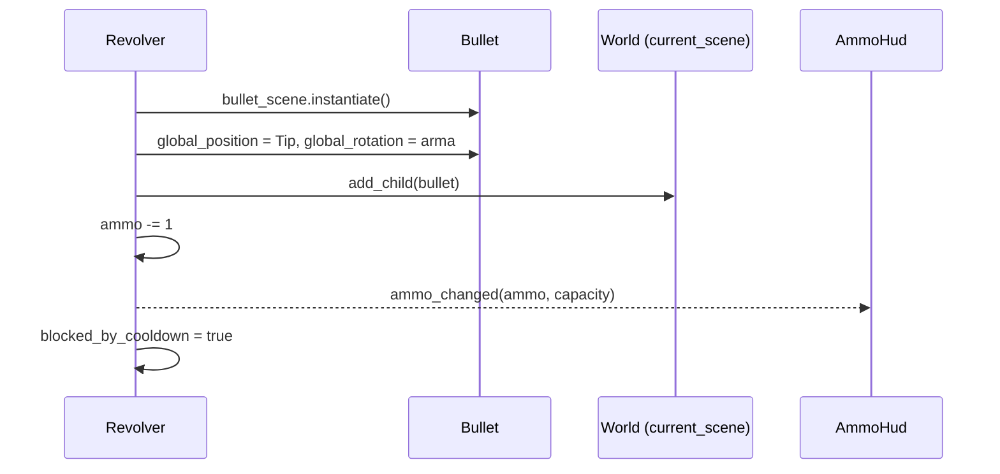
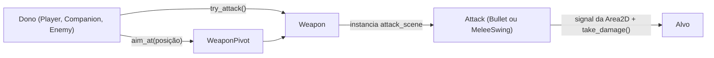
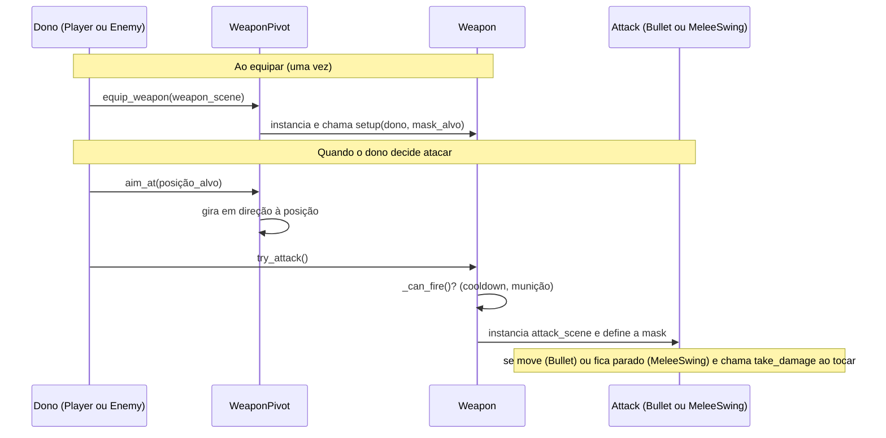

# 04 — Sistema de armas

**Arquivos:** `scripts/weapons/weapon.gd`, `weapon_pivot.gd`, `revolver.gd`, `rifle.gd`, `bullets/bullet.gd`
**Cenas:** `scenes/weapons/{Revolver,Rifle,Shotgun}.tscn`, `scenes/weapons/bullets/Bullet.tscn`

## Visão geral

A arma modular vive **sempre na cena do Player**. Cada arma é uma **scene própria** (permitindo comportamento único) e todas herdam de um script base `Weapon`. O `WeaponPivot` segura a arma ativa e cuida da rotação/flip em direção ao mouse.

```
Player
└── WeaponPivot (Node2D)        [WeaponPivot]  ← gira em direção ao mouse
    └── Revolver (Node2D)       [Revolver extends Weapon]
        ├── Sprite2D
        └── Tip (Marker2D)      ← ponto onde a bala nasce
```

Divisão de papéis: a **arma** decide *quando e como* atacar (cooldown, munição, onde o ataque nasce). O **ataque** (hoje só a `Bullet`) decide *o que acontece no contato*. Hoje essa divisão existe só na prática; a evolução para inimigos armados e ataques corpo a corpo está em [Evolução planejada](#planejado-evolução-arma-como-ferramenta-de-qualquer-personagem).

## [OK] Classe base `Weapon`

`class_name Weapon`, `extends Node2D`.

| Membro | Tipo | Função |
|---|---|---|
| `capacity` (export) | int | Munição máxima |
| `ammo` | int | Munição atual |
| `fire_cooldown` (export) | float | Intervalo entre tiros |
| `reload_cooldown` (export) | float | Duração do reload |
| `blocked_by_dodge` / `blocked_by_reload` / `blocked_by_cooldown` | bool | Motivos de bloqueio do disparo |
| `player` | CharacterBody2D | Dono, obtido pelo grupo `"player"` |

**Signals:**

| Signal | Payload | Quem escuta |
|---|---|---|
| `ammo_changed` | `current: int, max: int` | `AmmoHud` (ligado pelo `World`) |
| `reload_started` | `duration: float` | `Player` (barra de reload) |
| `reload_finished` | — | [PLANEJADO] comentado no código |

**Métodos:**

- `_can_fire()`: `true` se nenhum `blocked_by_*` está ativo **e** `ammo > 0`. Para adicionar um novo motivo de bloqueio, empilha-se com `or`. A própria arma gerencia o disparo.
- `_reload()`: ignora se já recarregando ou cheia; senão liga `blocked_by_reload`, arma o timer e emite `reload_started`.
- `_reload_cooldown(delta)` / `_fire_cooldown(delta)`: contadores chamados no `_process` de cada arma.
- `fire()`: **abstrato por convenção**; a base só imprime um aviso. Cada arma sobrescreve.
- `set_visibility(bool)`: liga/desliga `visible`.

## Armas concretas

| Arma | Script | Estado |
|---|---|---|
| Revolver | `revolver.gd` | [OK] capacidade 6, cooldown 0.28 s, reload 1.5 s |
| Rifle | `rifle.gd` | [PARCIAL] só o esqueleto (`_ready`/`_process` vazios) |
| Shotgun | — | [PARCIAL] cena existe (`Sprite2D` + `Marker2D`), **sem script** |

Cada weapon é uma scene. Ao trocar a arma, troca a scene que aparece na tela.
Weapon "modular" fica simplesmente como característica no sprite, caso sobre tempo.

### [OK] O que o `Revolver` faz

- No `_ready`: define `ammo = capacity` (arma cheia), emite `ammo_changed` e conecta lambdas em `player.dodge_started/dodge_ended` para ligar/desligar `blocked_by_dodge`.
- No `_process`: atualiza cooldowns; lê `Input` (`fire` → `fire()` se `_can_fire()`; `reload` → `_reload()`).

## [OK] `fire()` e a bala



O método `fire()` de cada arma decide **como** a scene da bala é instanciada. Hoje: uma bala reta. Isso abre espaço pra padrões diferentes por arma (espiral, cone...).

[RESOLVER] A bala é filha de `get_tree().current_scene` (o `World`), **não** da arma nem da chunk. Consequência: ela não se move junto com o player e não some se a chunk em que nasceu for descarregada. Ver também o alerta de `current_scene` em [01](01-main-scene-tree.md#observações-do-código).
[RESOLVER] Isso também implica que a scene da bala precisa ser destruída. Caso contrário pode acabar enchendo a memória.

## [PARCIAL] `Bullet`

```
Bullet (Node2D)            [bullet.gd]
└── Area2D
    ├── Sprite2D
    └── CollisionShape2D   (círculo)
```

- `direction = transform.x` no `_ready()`: por isso a arma precisa definir `global_rotation` **antes** do `add_child`.
- Movimento: `position += direction * speed * delta` em `_physics_process` (`speed` padrão 400).
- A `Area2D` existe, mas **nenhum signal está conectado** e nada configura layers/masks: a bala ainda não colide com nada.
- **Sem tempo de vida:** a bala nunca é destruída (`TODO` no `revolver.gd`).

**Comportamento decidido** (detalhes em [05](05-colisao-combate.md)), ainda não implementado [PLANEJADO]:

- Ao colidir, a própria bala chama `take_damage` no alvo (se ele tiver o método) e em seguida se dá `queue_free()`. Parede não tem `take_damage`, então só destrói a bala.
- `@export var lifetime` no script da bala, para o caso em que ela não acerta nada.
- Flag interna `spent` (variável comum, sem `@export`) para não causar dano em dois alvos no mesmo frame.

## [OK] `WeaponPivot`

- `@export weapon_scene` (hoje o `Revolver`, configurado em `Player.tscn`).
- `equip_weapon()`: instancia e adiciona a arma. É **placeholder**: não libera a arma anterior nem desconecta nada.
- `get_weapon()`: retorna a arma ativa (tipado como `Node2D`, não `Weapon`).
- `set_weapon_visibility(bool)`: usado pelo `Player` durante o dodge.
- `_process`: gira para o mouse com `atan2` e inverte `scale.y` (±3) quando o mouse está à esquerda, pra o sprite não ficar de cabeça pra baixo. O `3` é fixo no script.

## [PLANEJADO] Troca de arma

Não há sistema de troca. Ao implementar, lembrar que hoje as ligações são feitas **uma vez**:

- `World` conecta `ammo_changed` -> HUD só no início.
- `Player` conecta `reload_started` só no `_ready`.
- O `Revolver` conecta no `Player` no `_ready` da própria arma.

Uma arma nova precisa refazer essas ligações, e a antiga precisa ser liberada (`queue_free`).

## [RESOLVER] Dependência do dono da arma

`Weapon` descobre o dono com `get_first_node_in_group("player")`. Enquanto só o player tem arma, funciona. Com o companion armado, a arma dele se ligaria ao player (ver [03](03-player-companion.md#companion-)).

O `Revolver` também lê `Input` diretamente, o que impede outro personagem de usar a mesma arma. A solução planejada está em [Evolução planejada](#planejado-evolução-arma-como-ferramenta-de-qualquer-personagem).

## [PLANEJADO] Evolução: arma como ferramenta de qualquer personagem

> Fora do foco atual. Para o Teaser basta um inimigo dummy (só `take_damage` e vida), que **não depende de nada desta seção**. Isto registra a direção para quando existir o primeiro inimigo que ataca.

### Motivação

Hoje a arma só funciona no Player: lê o mouse, lê o clique e acha o dono pelo grupo `"player"`. A ideia é que **Player, Companion e inimigos** possam usar o mesmo sistema, incluindo ataques que não são tiro (corpo a corpo).

### Divisão de papéis

| Papel | Responde | Exemplos |
|---|---|---|
| **Dono** (Player, Companion, Enemy) | *Quando* atacar e *pra onde* mirar | Player lê o clique; inimigo decide pela IA |
| **Weapon** | *Como* atacar: cooldown, munição, onde o ataque nasce | Revolver, Shotgun, uma arma melee |
| **Attack** | *O que acontece* no contato | `Bullet`, `MeleeSwing` |



### Hoje x Planejado

| Hoje | Planejado |
|---|---|
| A arma lê o clique (`Input`) no próprio `_process` | O **dono** lê o clique (ou a IA decide) e chama `weapon.try_attack()` |
| O `WeaponPivot` pergunta "onde está o mouse?" pra girar | O dono diz "mira aqui": `pivot.aim_at(posição)` |
| A arma acha o dono pelo grupo `"player"` | Quem equipa a arma entrega o dono: `weapon.setup(dono, mask_alvo)` |
| A arma instancia a `Bullet` fixa | `Weapon` tem `@export attack_scene: PackedScene` e instancia o ataque escolhido no Inspector |
| Só existe a bala do player | A mesma scene de ataque serve a todos; muda só a **mask** (quem ela procura) |

### `try_attack()` e `aim_at()` [SUGESTÃO]

| Método | Significado |
|---|---|
| `try_attack()` | "Tenta atacar agora." A arma continua checando se pode (`_can_fire()`: cooldown, munição, bloqueios). Se puder, ataca; senão, ignora. Não importa **quem** chamou. |
| `aim_at(posição)` | "Gire em direção a este ponto." O pivot só gira; não sabe se o ponto é o mouse, o player ou outra coisa. |

O nome é `try_attack` (e não `try_fire`) porque nem todo ataque é tiro. O método interno `fire()` que cada arma sobrescreve pode ser renomeado para `attack()` pelo mesmo motivo [ABERTO].

| | Player | Inimigo |
|---|---|---|
| **Quando atacar** | Clique do mouse | IA decide (ex.: player ao alcance) |
| **Pra onde mirar** | `get_global_mouse_position()` | `player.global_position` |

O código da arma e do pivot é o mesmo nos dois casos; só muda quem chama.

### Inimigo corpo a corpo

Funciona igual: uma arma melee é uma `Weapon` cujo `fire()` instancia um `MeleeSwing` em vez de uma `Bullet`. O inimigo chama `try_attack()` quando o player está ao alcance e o golpe nasce na frente dele.

Inimigos que não precisam de arma (dano por contato, ataques de boss) podem instanciar o `Attack` diretamente, sem passar por `Weapon`.

### Como a arma recebe o dono [SUGESTÃO]

1. O `WeaponPivot` é filho do personagem, então sabe quem é o dono.
2. Ao instanciar a arma, o pivot chama `weapon.setup(dono, mask_alvo)`.
3. A arma guarda o dono e a `mask_alvo`, que aplica nos ataques que cria.

A `mask_alvo` vem da tabela de [05](05-colisao-combate.md): o Player usa `world` e `enemy`; um inimigo usa `world`, `player` e `companion`. Assim `PlayerBullet` e `EnemyBullet` não precisam ser scenes diferentes.

Cuidado: só o Player tem `dodge_started`/`dodge_ended`. Ao ligar o bloqueio por dodge, a arma deve checar se o dono tem o signal (`dono.has_signal("dodge_started")`) antes de conectar.



### Tipos de ataque [PLANEJADO]

Todo ataque é uma `Area2D` com `damage` que chama `take_damage` em quem tocar.

| | `Bullet` | `MeleeSwing` |
|---|---|---|
| Movimento | Anda em linha reta | Fica parado na frente do dono |
| Duração | Até colidir ou acabar o `lifetime` | Curta (só durante o golpe) |
| Ao acertar | Se destrói | **Não** se destrói |
| Acertos | Um alvo | Cada alvo **uma vez por golpe** |

Um script base `Hitbox` (com `damage` e a lógica de acertar uma vez) pode ser compartilhado pelos dois. Ver [08](08-hierarquia-de-classes.md). Só deve ser criado quando existir o segundo tipo de ataque.

### O que varia num ataque

Script define **o que o ataque faz**; scene define **como ele se parece**. Um mesmo script serve a várias scenes.

| O que muda | Exemplo | Onde mexer | Scene nova? |
|---|---|---|---|
| Números | dano, velocidade, tempo de vida | `@export` no script | Não |
| Aparência e formato | bala maior, golpe retangular em vez de arco | `Sprite2D` e `CollisionShape2D`: scene variante (ou cena herdada) com o mesmo script | Sim, reaproveitando o script |
| Comportamento | bala em espiral, perfurante | Script novo que herda do base | Sim, script e scene |

A arma escolhe qual scene usar pelo `@export attack_scene` no Inspector: o `Revolver.tscn` aponta para `Bullet.tscn`, uma Shotgun aponta para uma scene de projétil menor. O código de `fire()` é o mesmo.

### Ordem de implementação sugerida

1. **Dano mínimo** (necessário pro Teaser): `take_damage` nos alvos, bala que colide e se destrói, layers aplicadas nas cenas.
2. Tempo de vida da bala.
3. Script base `Hitbox`, só quando existir o `MeleeSwing`.
4. `try_attack`, `aim_at` e `setup` (desacoplar arma e pivot do Player), só quando for criar o primeiro inimigo armado.

### Em aberto

- [ABERTO] Renomear o `fire()` interno para `attack()`.
- [ABERTO] Estrutura da hitbox do `MeleeSwing` (ver [05](05-colisao-combate.md)).
- [ABERTO] Munição e reload de inimigos: infinita, ou usam o mesmo sistema do Player?
- [ABERTO] Onde os ataques nascem na árvore (hoje `current_scene`, ver acima).