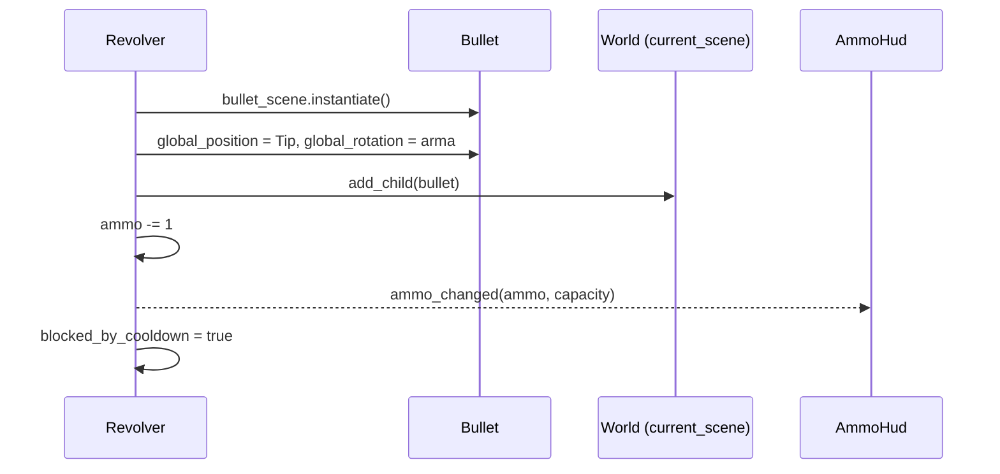

# 04 — Sistema de armas

**Arquivos:** `scripts/weapons/weapon.gd`, `weapon_pivot.gd`, `revolver.gd`, `rifle.gd`, `bullets/bullet.gd`
**Cenas:** `scenes/weapons/{Revolver,Rifle,Shotgun}.tscn`, `scenes/weapons/bullets/Bullet.tscn`

## Visão geral

A arma modular vive **sempre na cena do Player**. Cada arma é uma **scene própria** (permitindo comportamento único) e todas herdam de um script base `Weapon`. O `WeaponPivot` segura a arma ativa e cuida da rotação/flip em direção ao mouse.

```
Player
└── WeaponPivot (Node2D)        [WeaponPivot]  ← gira em direção ao mouse
    └── Revolver (Node2D)       [Revolver extends Weapon]
        ├── Sprite2D
        └── Tip (Marker2D)      ← ponto onde a bala nasce
```

## [OK] Classe base `Weapon`

`class_name Weapon`, `extends Node2D`.

| Membro | Tipo | Função |
|---|---|---|
| `capacity` (export) | int | Munição máxima |
| `ammo` | int | Munição atual |
| `fire_cooldown` (export) | float | Intervalo entre tiros |
| `reload_cooldown` (export) | float | Duração do reload |
| `blocked_by_dodge` / `blocked_by_reload` / `blocked_by_cooldown` | bool | Motivos de bloqueio do disparo |
| `player` | CharacterBody2D | Dono, obtido pelo grupo `"player"` |

**Signals:**

| Signal | Payload | Quem escuta |
|---|---|---|
| `ammo_changed` | `current: int, max: int` | `AmmoHud` (ligado pelo `World`) |
| `reload_started` | `duration: float` | `Player` (barra de reload) |
| `reload_finished` | — | [PLANEJADO] comentado no código |

**Métodos:**

- `_can_fire()`: `true` se nenhum `blocked_by_*` está ativo **e** `ammo > 0`. Para adicionar um novo motivo de bloqueio, empilha-se com `or`. A própria arma gerencia o disparo.
- `_reload()`: ignora se já recarregando ou cheia; senão liga `blocked_by_reload`, arma o timer e emite `reload_started`.
- `_reload_cooldown(delta)` / `_fire_cooldown(delta)`: contadores chamados no `_process` de cada arma.
- `fire()`: **abstrato por convenção**; a base só imprime um aviso. Cada arma sobrescreve.
- `set_visibility(bool)`: liga/desliga `visible`.

## Armas concretas

| Arma | Script | Estado |
|---|---|---|
| Revolver | `revolver.gd` | [OK] capacidade 6, cooldown 0.28 s, reload 1.5 s |
| Rifle | `rifle.gd` | [PARCIAL] só o esqueleto (`_ready`/`_process` vazios) |
| Shotgun | — | [PARCIAL] cena existe (`Sprite2D` + `Marker2D`), **sem script** |

Cada weapon é uma scene. Ao trocar a arma, troca a scene que aparece na tela.
Weapon "modular" fica simplesmente como característica no sprite, caso sobre tempo.

### [OK] O que o `Revolver` faz

- No `_ready`: define `ammo = capacity` (arma cheia), emite `ammo_changed` e conecta lambdas em `player.dodge_started/dodge_ended` para ligar/desligar `blocked_by_dodge`.
- No `_process`: atualiza cooldowns; lê `Input` (`fire` → `fire()` se `_can_fire()`; `reload` → `_reload()`).

## [OK] `fire()` e a bala



O método `fire()` de cada arma decide **como** a scene da bala é instanciada. Hoje: uma bala reta. Isso abre espaço pra padrões diferentes por arma (espiral, cone...).

[RESOLVER] A bala é filha de `get_tree().current_scene` (o `World`), **não** da arma nem da chunk. Consequência: ela não se move junto com o player e não some se a chunk em que nasceu for descarregada. Ver também o alerta de `current_scene` em [01](01-main-scene-tree.md#observações-do-código).
[RESOLVER] Isso também implica que a scene da bala precisa ser destruída. Caso contrário pode acabar enchendo a memória.

## [PARCIAL] `Bullet`

```
Bullet (Node2D)            [bullet.gd]
└── Area2D
    ├── Sprite2D
    └── CollisionShape2D   (círculo)
```

- `direction = transform.x` no `_ready()`: por isso a arma precisa definir `global_rotation` **antes** do `add_child`.
- Movimento: `position += direction * speed * delta` em `_physics_process` (`speed` padrão 400).
- A `Area2D` existe, mas **nenhum signal está conectado** e nada configura layers/masks: a bala ainda não colide com nada.
- **Sem tempo de vida:** a bala nunca é destruída (`TODO` no `revolver.gd`).
- Colisão e dano: ver [05](05-colisao-combate.md).

## [OK] `WeaponPivot`

- `@export weapon_scene` (hoje o `Revolver`, configurado em `Player.tscn`).
- `equip_weapon()`: instancia e adiciona a arma. É **placeholder**: não libera a arma anterior nem desconecta nada.
- `get_weapon()`: retorna a arma ativa (tipado como `Node2D`, não `Weapon`).
- `set_weapon_visibility(bool)`: usado pelo `Player` durante o dodge.
- `_process`: gira para o mouse com `atan2` e inverte `scale.y` (±3) quando o mouse está à esquerda, pra o sprite não ficar de cabeça pra baixo. O `3` é fixo no script.

## [PLANEJADO] Troca de arma 

Não há sistema de troca. Ao implementar, lembrar que hoje as ligações são feitas **uma vez**:

- `World` conecta `ammo_changed` -> HUD só no início.
- `Player` conecta `reload_started` só no `_ready`.
- O `Revolver` conecta no `Player` no `_ready` da própria arma.

Uma arma nova precisa refazer essas ligações, e a antiga precisa ser liberada (`queue_free`).

## [RESOLVER] Dependência do dono da arma

`Weapon` descobre o dono com `get_first_node_in_group("player")`. Enquanto só o player tem arma, funciona. Com o companion armado, a arma dele se ligaria ao player (ver [03](03-player-companion.md#companion-)).
