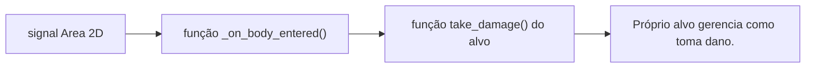
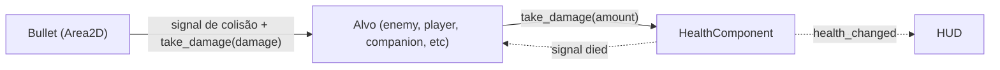

# 05 — Colisão e combate

> Layers/Masks e fluxo de dano decididos; falta aplicar nas cenas e definir o golpe melee

## Estado atual

| Item | Status | Descrição
|---|---|---|
| Nomes de layers no `project.godot` | [OK] | configurados |
| `collision_layer` / `collision_mask` nas cenas | [PLANEJADO]| precisa ser definido nas scenes de acordo com o planejado |
| Colisão do player com paredes das chunks | [PARCIAL] | `CharacterBody2D` e `StaticBody2D` funcionam por estarem no padrão |
| Colisão de balas do player | [PARCIAL] | `Area2D` existe na `Bullet`, sem signal, lifetime e destrução |
| Balas inimigas | [PLANEJADO] |  | 
| Ataques corpo a corpo inimigos | [PLANEJADO] | | 
| Trigger de troca de chunk | [PLANEJADO] | ver [02](02-chunk-manager.md#troca-de-chunk) |
| HealthComponent | [PLANEJADO] | |
| Contrato take_damage() | [PLANEJADO] | |

## Tipos de interação a cobrir

1. Player/companion x paredes e objetos sólidos
2. Bala do player x inimigos (e paredes)
3. Bala inimiga x player/companion (e paredes)
4. Ataque corpo a corpo inimigo x player/companion
5. Ataque corpo a corpo do companion x inimigos
6. Player x trigger de chunk / porta / item

## Layers
[OK] 
Nomear em *Project Settings -> Layer Names -> 2D Physics* para não trabalhar com números soltos.

| # | Nome | O que é |
|---|---|---|
| 1 | `world` | Paredes e obstáculos sólidos |
| 2 | `player` | Corpo do player |
| 3 | `player_projectile` | Balas do player/companion |
| 4 | `companion` | Corpo do companion |
| 5 | `companion_hitbox` | Área de ataque corpo a corpo do companion |
| 6 | `enemy` | Corpo dos inimigos |
| 7 | `enemy_projectile` | Balas inimigas |
| 8 | `enemy_hitbox` | Área de ataque corpo a corpo inimigo |
| 9 | `trigger` | Triggers de chunk, portas, itens |

Quem **enxerga** o quê (mask):

| Nó | Layer | Mask | Função | 
|---|---|---|---|
| Player | `player` | `world`, `enemy`, `companion` | `colisao do body` |
| Companion | `companion` | `world`, `enemy`, `player` | `colisão do body` |
| Hitbox do companion | `companion_hitbox` | `enemy` | `colisão do golpe com inimigos` |
| Bala do player | `player_projectile` | `world`, `enemy` | `colisão da bala com inimigos/mundo` | 
| Bala inimiga | `enemy_projectile` | `world`, `player`, `companion` | `colisão da bala com player/companion e mundo` |
| Hitbox inimiga | `enemy_hitbox` | `player`, `companion` | `colisão do golpe com player/companion` |
| Inimigo | `enemy` | `world`,  `player`, `companion` | `colisão do body` |
| Trigger de chunk | `trigger` | `player` | `avisar posição do player pro Chunk Manager` |

## Conexão com as regras de jogo

- **Sem i-frames no dodge** (decisão em [03](03-player-companion.md#dodge)): o corpo/hurtbox do player continua ativo enquanto rola. Não desligar colisão durante o dodge.
- **Vida separada, derrota compartilhada** (player e companion): o dano precisa chegar ao dono certo, o que pesa na escolha da interface de dano abaixo.
- ****

## Hitbox e hurtbox
A hitbox (Area2D) emite um sinal quando colide com algo, que fica conectado à uma função (_on_body_entered(body: Node) por exemplo).
Essa função chama o método "take_damage" um contrato entre hitbox e hurtbox (que pode ser o próprio body do node que colidiu).
O alvo (corpo ou hurtbox) no seu método, chama a implementação de dano desejada (por exemplo, de um health_component, ou simplesmente se destrói)

Por padrão, o próprio body terá o papel de ser a hurtbox dos Characters (Player, Companion, NPC, Enemy, Boss, etc). Caso seja necessário, por decisão de design, será implementado posteriormente o node Area2D pras hurtboxes e uma layer será criada para tal.

### Maneira que o dano é aplicado

A função take_damage() é implementada pelo alvo. No caso de um player/enemy/companion, estes chamam o método do HealthComponent. ver[08](08-hierarquia-de-classes.md)
No caso de objetos (como por exemplo, um barril de pólvora que explode), este apenas implementa o próprio take damage.

# Decisões
### Quem destrói a bala ao colidir
[OK] 
A própria bala. No `body_entered`/`area_entered`, ela chama `take_damage` no alvo
(se ele tiver o método) e em seguida se dá `queue_free()`. Isso vale também para
paredes: sem `take_damage`, a bala só se destrói. Só a bala sabe se deve sumir
(uma bala perfurante, por exemplo, seria uma mudança local).

### Tempo de vida da bala
[OK]
Pertence à bala: `@export var lifetime` no script da bala, com valor padrão na
scene. Cobre o caso em que ela não acerta nada. Variantes de bala ajustam o
valor no Inspector.

### Flag `spent` (detalhe de implementação)

Variável interna da bala (`var spent := false`, sem `@export`). Evita que a bala cause
dano em mais de um alvo se tocar em dois no mesmo frame, já que o `queue_free()` só
remove o nó no fim do frame. Não se aplica a balas perfurantes.

## Decisões em aberto
- [ABERTO] Hitbox do ataque corpo a corpo do companion (mesma estrutura dos inimigos?).
- [ABERTO] Gatilho de toque dos objetos (tem como virar padrão reaproveitável?)
- [ABERTO] Explosão como hitbox temporária