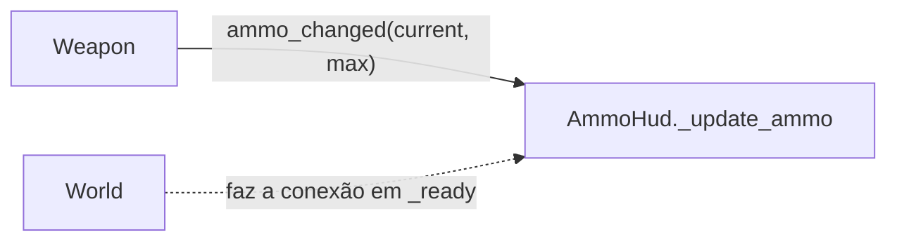

# 06 — HUD

**Cena/nó:** `HudManager` (`CanvasLayer`), filho estático do `World` · **Script:** `scripts/hud_manager.gd`
**HUDs:** `scenes/huds/AmmoHUD.tscn` · `scripts/huds/ammo_hud.gd`

## Responsabilidade

O `HudManager` é o **único dono do que aparece na interface**. Decide qual HUD está na tela; cada HUD é uma scene independente, **anexada a ele por código** (mesma lógica dos outros sistemas: o gerente instancia e dá `add_child`).

| Item | Status |
|---|---|
| Instanciar a HUD de munição | [OK] |
| Escolher/alternar qual HUD é mostrada | [PLANEJADO] |
| Outras HUDs (vida do player e do companion, etc.) | [PLANEJADO] |
| Overlay de fade para transição de chunks avulsas | [SUGESTÃO] ver [02](02-chunk-manager.md#chunks-avulsas-tutorial-boss) |
| Menu de pause / mapa | [PLANEJADO] ver [01](01-main-scene-tree.md#interfaces-alternativas-e-pause) |

## [OK] Estrutura atual 

```
HudManager (CanvasLayer)   [hud_manager.gd]   @export ammo_hud_scene
└── AmmoHud (Control)      [ammo_hud.gd]
    └── VBoxContainer
        ├── Label          ← texto "atual/máx"
        └── TextureRect    ← ícone da arma
```

- `HudManager._ready()` instancia `ammo_hud_scene`, guarda em `var ammo_hud: Control` e adiciona como filho.
- `AmmoHud._update_ammo(current, max)` atualiza o texto da `Label` (`"%d/%d"`).

## Fluxo de dados



A HUD **não conhece** a arma; quem liga os dois é o `World`. Bom para desacoplar, mas ver as observações abaixo.

## Observações

- [RESOLVER] A HUD só recebe valor depois do primeiro `ammo_changed`; o valor inicial é perdido (ver [01](01-main-scene-tree.md#observações-do-código)).
- [RESOLVER] O `World` chama `$HudManager.ammo_hud._update_ammo`, um método com `_` (privado por convenção) acessado de fora.
- [RESOLVER] Trocar de arma exigirá religar `ammo_changed`.

## Ideias pra resolver
- [SUGESTÃO] Dar ao `HudManager` uma API pública, por exemplo `bind_weapon(weapon)`, que faz a conexão e já chama a atualização inicial com `weapon.ammo` e `weapon.capacity`. O `World` deixa de conhecer `ammo_hud`.
- [SUGESTÃO] Renomear `_update_ammo` para `update_ammo` (ou deixá-lo interno à HUD, chamado só pelo manager).
- [SUGESTÃO] Para alternar HUDs: o manager guarda um dicionário `nome -> nó` e liga/desliga `visible`, em vez de instanciar/liberar toda vez.
