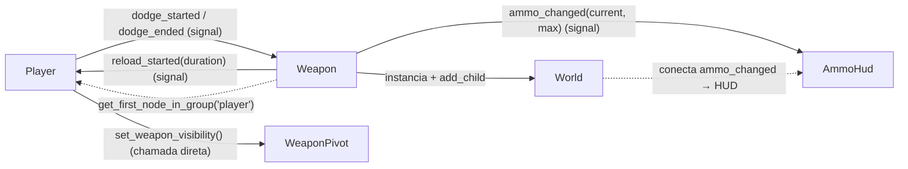

# 07 — Comunicação entre classes
[RESOLVER] Mapeamento de **como cada sistema fala com os outros**. Precisa de um planejamento mais estruturado

## Mapa geral

## Tabela de conexões

| # | De -> Para | Mecanismo | Payload | Quem conecta / onde | Status |
|---|---|---|---|---|---|
| 1 | Player -> Weapon | signal `dodge_started` | — | `Revolver._ready` (lambda liga `blocked_by_dodge`) | [OK] |
| 2 | Player -> Weapon | signal `dodge_ended` | — | `Revolver._ready` (lambda desliga `blocked_by_dodge`) | [OK] |
| 3 | Player -> WeaponPivot | **chamada direta** `set_weapon_visibility(bool)` | bool | `player.gd` (`_process_dodge`) | [OK] |
| 4 | Weapon -> Player | signal `reload_started` | `duration: float` | `Player._ready` via `weapon_pivot.get_weapon()` | [OK] |
| 5 | Weapon -> Player | signal `reload_finished` | — | (comentado) | [PLANEJADO] |
| 6 | Weapon -> AmmoHud | signal `ammo_changed` | `current, max` | `World._ready` | [OK] |
| 7 | Weapon -> World | chamada direta: `get_tree().current_scene.add_child(bullet)` | node `Bullet` | `Revolver.fire()` | [OK] |
| 8 | Weapon -> Player (lookup) | grupo `"player"` | — | `Weapon` (`@onready var player`) | [OK] |
| 9 | Player -> grupo | `add_to_group("player")` | — | `Player._enter_tree` | [OK] |

## [RESOLVER] Pontos de atenção

1. **Dois cronômetros de reload.** A arma conta o reload e o player conta o dele (#4). O `reload_finished` (#5) eliminaria a duplicação.
2. **Valor inicial de munição perdido.** O `ammo_changed` do `_ready` da arma é emitido antes do #6 existir.
3. **Arma depende do grupo `"player"` (#8)** para conectar o dodge. Quebra com a arma do companion.
4. **Ligações feitas uma só vez** (#4, #6): precisam ser refeitas na troca de arma.
5. **Método privado usado fora da classe:** `_update_ammo`, chamado pelo `World`.
6. **Arma lê `Input` diretamente** (`fire`, `reload`), em vez de receber comandos.
7. **Player faz um push ao invés de emitir signal pra própria arma se esconder.** Ainda falta uma convenção de comunicação, então por enquanto ok, mas é interessante ser padronizado no futuro.

## Ordem de inicialização (resumo)

1. `World.tscn` carrega -> `HudManager._ready` (instancia `AmmoHud`).
2. `World._ready` -> `add_child(player)` -> `_ready` do `Player`, do `WeaponPivot` (equipa `Revolver`) e do `Revolver` (emite `ammo_changed` **sem ouvintes**, conecta no player).
3. `Player._ready` conecta `reload_started` da arma.
4. `World._ready` -> `add_child(chunk_manager)` -> instancia `initial_chunk`.
5. `World._ready` conecta `ammo_changed` -> HUD.
