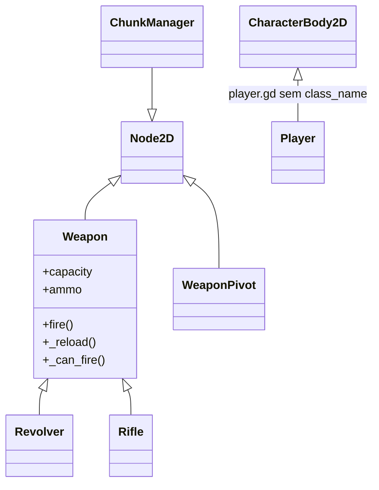
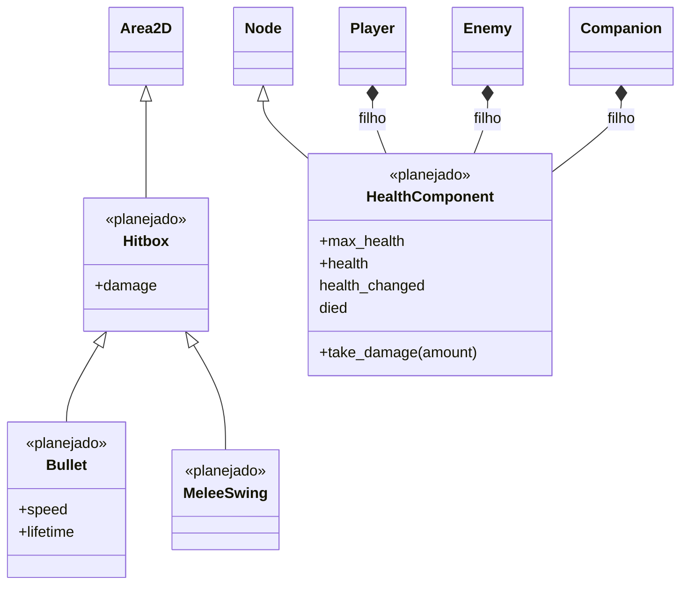

# 08 — Hierarquia de classes

> Nota: isto é sobre **heranças de script** (classes), independente da árvore de cenas.

## [OK] Hoje

Só existe uma hierarquia:

| Script | `class_name` | Herda de |
|---|---|---|
| `Weapon` | `Weapon` | `Node2D` |
| `Revolver`, `Rifle` | — | `Weapon` |
| `WeaponPivot` | `WeaponPivot` | `Node2D` |
| `ChunkManager` | `ChunkManager` | `Node2D` |
| `Player` | — | `CharacterBody2D` |

Regra de `Weapon`: a base define estado, signals e regras comuns; cada arma só sobrescreve `fire()` e o que for próprio dela.

## [PLANEJADO] Combate: ataques e vida

(detalhes em [04](04-weapon-system.md) e [05](05-colisao-combate.md)). Nada disso existe no código ainda.

Duas ideias diferentes aparecem no diagrama, e é importante não misturar:

| Ideia | O que é | No diagrama |
|---|---|---|
| **Herança** | "É um": `Bullet` **é uma** `Hitbox` | Seta `<\|--` |
| **Composição** | "Tem um": o `Player` **tem** um `HealthComponent` como nó filho | Seta `*--` |

### [PLANEJADO] `Hitbox` (base dos ataques)

Script base com `damage` e a lógica comum de "chamar `take_damage` em quem tocar". `Bullet` e `MeleeSwing` herdam dele e só acrescentam o que é próprio:

| | `Bullet` | `MeleeSwing` |
|---|---|---|
| Movimento | Anda em linha reta | Parado na frente do dono |
| Ao acertar | Se destrói | Não se destrói; acerta cada alvo uma vez por golpe |
| Duração | `lifetime` | Curta (durante o golpe) |

Só deve ser criado quando existir o segundo tipo de ataque (`MeleeSwing`); antes disso seria especular.

[ABERTO] Hoje o script da `Bullet` está no nó raiz (`Node2D`), e a `Area2D` é um filho. Se a `Hitbox` herdar de `Area2D`, a raiz da `Bullet.tscn` precisaria virar `Area2D`. Decidir isso ao criar a base.

### [PLANEJADO] `HealthComponent` (composição, não herança)

Um nó filho reaproveitável que cuida só da vida. Fica anexado a quem precisa (Player, Companion, inimigos). Não é uma classe base de personagens: o personagem continua herdando de `CharacterBody2D`.

| Membro | Função |
|---|---|
| `@export max_health` | Vida máxima |
| `health` | Vida atual |
| `take_damage(amount)` | Subtrai (sem passar de zero) e emite os signals |
| `health_changed(current, max)` | Quem escuta: HUD de vida |
| `died` | Quem escuta: o dono (morrer, tocar animação) |

A lógica de vida fica escrita uma vez só. Cada personagem decide apenas **o que fazer** quando toma dano ou morre.

### [PLANEJADO] Contrato `take_damage` (não é uma classe)

GDScript não tem interfaces. O contrato é por **método com o mesmo nome**: quem causa dano checa `body.has_method("take_damage")` e chama. Quem recebe dano implementa o método do jeito que fizer sentido:

| Alvo | Implementação de `take_damage` |
|---|---|
| Player, Companion, inimigos | Repassam para o `HealthComponent` |
| Objetos (barril, parede quebrável) | Lógica própria (explodir, se destruir) |
| Parede comum | Não implementa. A bala só se destrói |

Assim a `Hitbox` não precisa saber quem é o alvo, e o alvo pode trocar sua implementação sem mexer nos ataques.

## [ABERTO] Futuro

Nada decidido ainda; anotações do que foi pensado:

- **Inimigos:** provavelmente uma classe base.
- **Personagens:** talvez uma base que derive em `Player` / `NPC` / `Companion`.

| Candidato | Player | Companion | Inimigo |
|---|---|---|---|
| Vida / receber dano | sim | sim | sim |
| Movimento | sim (input) | sim (IA/comando) | sim (IA) |
| Arma | sim | sim | alguns |
| Dodge | sim | esquiva por comando | talvez |

O `HealthComponent` já cobre a primeira linha da tabela (vida e dano) sem precisar de herança. O que sobraria para uma base de personagem seria movimento e o uso de arma/pivot, o que reduz o ganho de criá-la.

[SUGESTÃO] Criar a classe base só quando existir a segunda classe concreta (por exemplo, o primeiro inimigo real além do dummy), em vez de desenhá-la antes.