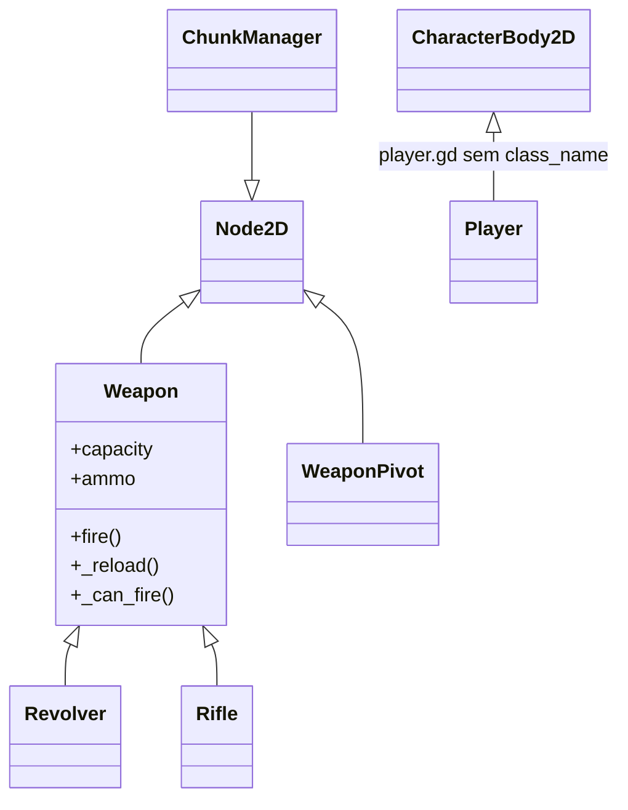

# 08 — Hierarquia de classes

> Nota: isto é sobre **heranças de script** (classes), independente da árvore de cenas.

## [OK] Hoje 

Só existe uma hierarquia:

| Script | `class_name` | Herda de |
|---|---|---|
| `Weapon` | `Weapon` | `Node2D` |
| `Revolver`, `Rifle` | — | `Weapon` |
| `WeaponPivot` | `WeaponPivot` | `Node2D` |
| `ChunkManager` | `ChunkManager` | `Node2D` |
| `Player` | — | `CharacterBody2D` |

Regra de `Weapon`: a base define estado, signals e regras comuns; cada arma só sobrescreve `fire()` e o que for próprio dela.

## [ABERTO] Futuro

Nada decidido ainda; anotações do que foi pensado:

- **Inimigos:** provavelmente uma classe base.
- **Personagens:** talvez uma base que derive em `Player` / `NPC` / `Companion`.

| Candidato | Player | Companion | Inimigo |
|---|---|---|---|
| Vida / receber dano | sim | sim | sim |
| Movimento | sim (input) | sim (IA/comando) | sim (IA) |
| Arma | sim | sim | alguns |
| Dodge | sim | esquiva por comando | talvez |
