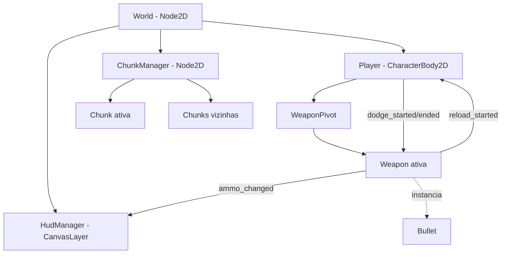

# TDD — Technical Design Document

**Projeto:** BeastBond · **Engine:** Godot 4.7 (GDScript) · **Alunos:** Lucas Cavallin Caczmareki e Gustavo dos Santos Leon

> Última revisão: 30/09/2026, com base no commit `2403147` (`main`).

## Objetivo

Este documento descreve **como** o jogo é construído: árvore de cenas, responsabilidade de cada sistema, comunicação entre eles e decisões técnicas. O **o quê** (mecânicas, história, arte) fica no GDD, em [`../gdd/`](../gdd/). O capítulo [`09-tecnico.md`](../gdd/content/09-tecnico.md) do GDD cobre só escopo e requisitos; a arquitetura mora aqui.

## Legenda de status

Cada seção indica em que pé está o que descreve:

| Marca | Significado |
|---|---|
| [OK] | Implementado e conferido no código |
| [PARCIAL] | Implementado parcialmente |
| [PLANEJADO] | Planejado / decidido, ainda não implementado |
| [ABERTO] | Em aberto, sem decisão |
| [SUGESTÃO] | Sugestão que não vem de decisão tomada, vale validar |
| [RESOLVER] | Bug, problema ou inconsistência encontrado que ainda precisa de solução |

## Índice

| # | Documento | Assunto |
|---|---|---|
| 01 | [Main Scene Tree](01-main-scene-tree.md) | Árvore principal, o papel do `World`, ordem de inicialização |
| 02 | [ChunkManager](02-chunk-manager.md) | Carregamento de chunks, chunks avulsos (tutorial/boss), câmera |
| 03 | [Player e Companion](03-player-companion.md) | Cena do player, dodge, animação, companion |
| 04 | [Sistema de armas](04-weapon-system.md) | `Weapon`, `WeaponPivot`, `fire()`, `Bullet` |
| 05 | [Colisão e combate](05-colisao-combate.md) | Layers/masks, projéteis e ataques inimigos |
| 06 | [HUD](06-hud.md) | `HudManager` e as HUDs |
| 07 | [Comunicação entre classes](07-comunicacao.md) | Mapa de signals, chamadas diretas e grupos |
| 08 | [Hierarquia de classes](08-hierarquia-de-classes.md) | Heranças atuais e futuras |

## Visão geral

## Convenção de comunicação

**Status:** [ABERTO]
Hoje o código tente a funcionar assim por conveniência, mas no futuro pode ser padronizado por signals.
**"Chamar pra baixo, sinalizar pra cima."** Um nó pode chamar métodos dos seus filhos diretamente. Filhos e irmãos avisam o resto via **signals**.
- Exceções estão anotadas em [07](07-comunicacao.md).

## Decisões em aberto

| Tema | Onde | Resumo |
|---|---|---|
| Onde fica a câmera | [02](02-chunk-manager.md#câmera) | `Player`, `World` ou `ChunkManager` |
| Nó "pai" de interfaces (mapa/pause) | [01](01-main-scene-tree.md#interfaces-alternativas-e-pause) | Precede o `World`? Fica dentro dele? |
| Estado de chunks descarregadas | [02](02-chunk-manager.md#decisões-em-aberto) | Inimigos mortos/itens coletados persistem? |
| Quem faz o fade de transição | [02](02-chunk-manager.md#chunks-avulsas-tutorial-boss) | `HudManager` ou camada própria |
| Arma modular: subclasses vs. modificadores | [04](04-weapon-system.md#arma-modular-tensão-de-design) | Como upgrades mudam o padrão de tiro |
| Layers/masks e dano | [05](05-colisao-combate.md) | Nada definido ainda |
| Classes base de personagens/inimigos | [08](08-hierarquia-de-classes.md) | Só `Weapon` existe |

## Como manter

- Mudou a árvore de cenas, um signal ou um export? Atualize o doc. Preferencialmente no mesmo commit.
- Mudou de status. Troque a marca.
- Decisão relevante tomada? Registre o **motivo** na seção "Decisões" do sistema correspondente.
